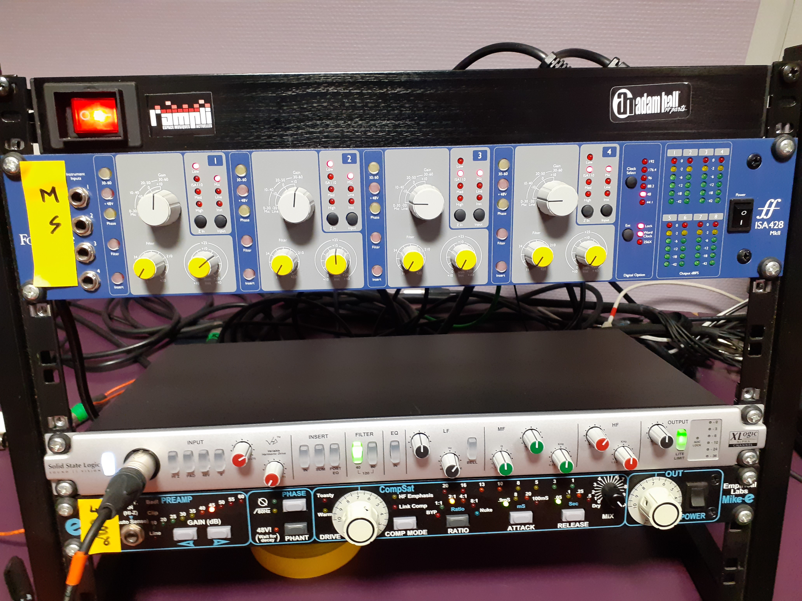
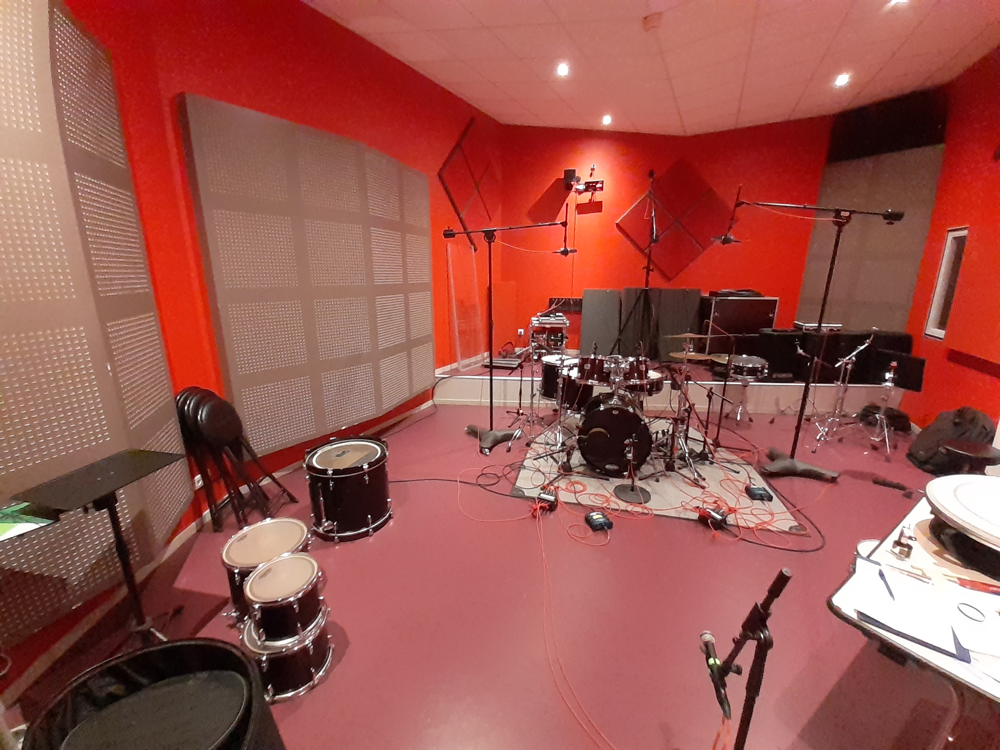
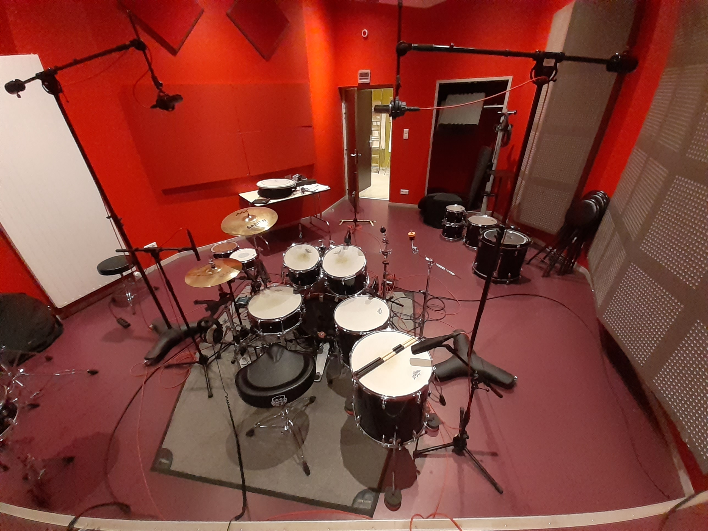
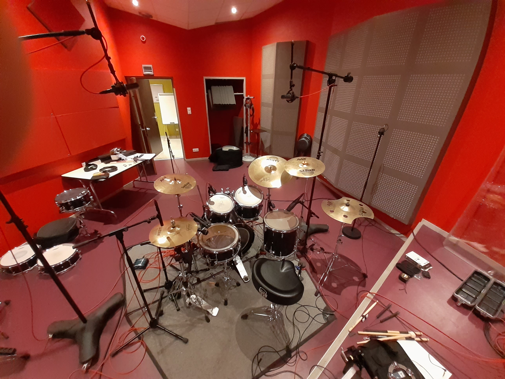
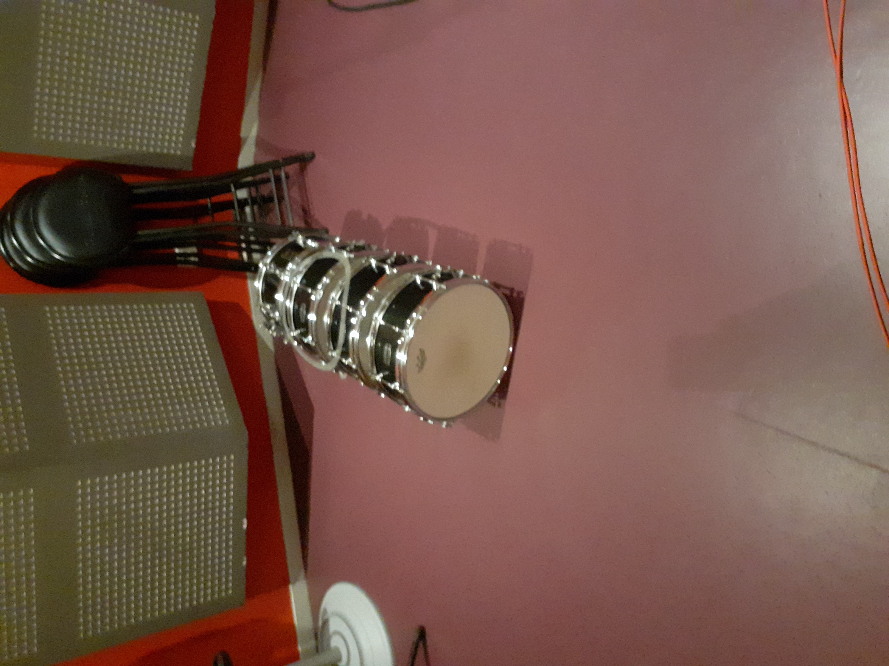

Download page of Apeira Drums: please send an e-mail to "contact-at-apeira-technologies.fr" to obtain the letter of engagement to sign before using the dataset.

For reviewers only : direct link [here](https://apeira-test.s3.eu-west-3.amazonaws.com/apeira_drums/)

# Drums and Cymbals List

| Name            | Description                                       |
| --------------- | ------------------------------------------------- |
| Kick Yamaha 22  | Yamaha Stage Custom 22x17                         |
| Kick Yamaha 20  | Yamaha Stage Custom 20x17                         |
| Snare Yamaha 1  | Yamaha Stage Custom 14x5.5                        |
| Toms 10 (22&20) | Yamaha Stage Custom 10x7                          |
| Toms 12 (22&20) | Yamaha Stage Custom 12x8                          |
| Toms 14 (22&20) | Yamaha Stage Custom 14x13                         |
| Toms 16 (22)    | Yamaha Stage Custom 16x15                         |
| Hi-hat          | Zildjian K-Custom Dark Hat 13"                    |
| Ride            | Zildjian K Jazz Ride 20"                          |
| Crash 1A        | Sabian AAX Studio Crash 14                        |
| Crash 1B        | Sabian AAX Studio Crash 14                        |
| Crash 2A        | Sabian AAXPlosion Crash 16                        |
| Crash 2B        | Sabian AA Medium Crash 18                         |
| Crash 3         | Zildjian A-Custom Crash                           |
| China           | Sabian Pro Series China 20                        |
| Special         | Nicolas Guaglianone Signature (Machined AA Crash) |

# Microphone List

| Drum Type          | Microphone             | Preamp                                   |
| ------------------ | ---------------------- | ---------------------------------------- |
| Kick               | Shure Beta 52A         | Yamaha SB16                              |
| Kick               | Shure Beta 91A         | Yamaha SB16                              |
| Kick               | Solomon SubKick        | Yamaha SB16                              |
| Snare Top          | Shure SM57             | Yamaha SB16                              |
| Snare Top          | Audio-Technica AT4041  | Yamaha SB16                              |
| Snare Top          | Beyerdynamic M88       | Yamaha SB16                              |
| Snare Bottom       | Shure SM57             | Yamaha SB16                              |
| Tom (higher)       | Senheisser e904        | Yamaha SB16                              |
| Tom (lowest)       | Senheiser MD421        | Yamaha SB16                              |
| Overheads          | AKG C214               | Yamaha SB16                              |
| Hi-hat             | Audio-Technica AT4041  | Yamaha SB16                              |
| Cymbal (close mic) | Charter Oak M900 (Omni | Yamaha SB16                              |
| Triggers           | AKG C214               | BSS AR133 into Yamaha SB16               |
| Mid Ambiance       | Beyerdynamic 160       | Focusrite ISA 428 MkII                   |
| Side Ambiance      | Beyerdynamic 130       | Focusrite ISA 428 MkII                   |
| Mono Room          | Coles 4038             | Empirical Labs Mike-E (with compression) |

For the Focusrite ISA and the Mike-E compression setting, :

# Tuning List

| Drum Type      | Drum Head              | Tuning                      |
| -------------- | ---------------------- | --------------------------- |
| Kick Yamaha 22 | Remo                   | Lowest Possible Pitch (LPP) |
| Kick Yamaha 20 | Remo                   | Lowest Possible Pitch (LPP) |
| Kick Yamaha 20 | Remo                   | Lowest Possible Pitch (LPP) |
| Kick Yamaha 20 | Remo                   | Lowest Possible Pitch (LPP) |
| Snare Yamaha 1 | Remo Pinstripe         | )                           |
| Snare Yamaha 2 | Remo Ambassador Coated | )                           |
| Snare Yamaha 3 | Remo CSX               | )                           |
| Toms Yamaha 22 | Remo CSX               | )                           |
| Toms Yamaha 20 | Remo CSX               | )                           |

# Recording setup and miscellaneous images

| Description                 | Image                                                         |
| --------------------------- | ------------------------------------------------------------- |
| Recording Setup (Yamaha 22) |  |
| Recording Setup (Yamaha 22) |  |
| Recording Setup (Yamaha 20) |  |
| Snare Drums                 |  |
